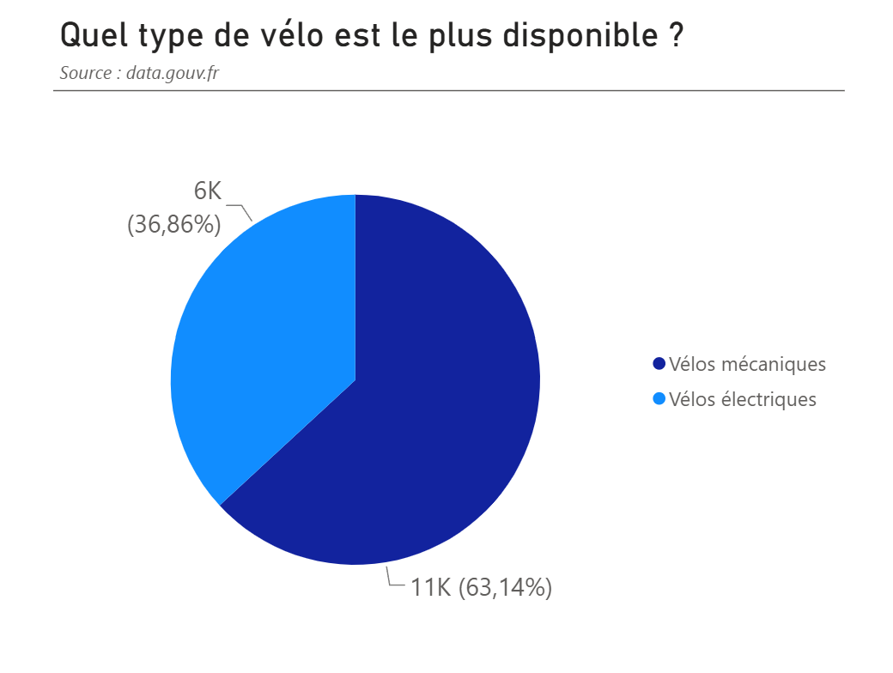
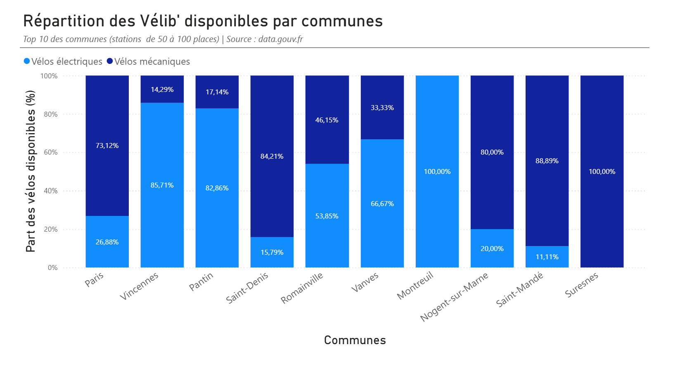

Introduction

Les données Vélib’ permettent d’étudier la disponibilité des vélos mécaniques et électriques dans les différentes communes. L’objectif est de voir quel type de vélo est le plus disponible et si cette répartition varie selon les communes.

Source : [data.gouv.fr](https://www.data.gouv.fr/datasets/velib-velos-et-bornes-disponibilite-temps-reel)

Graphique 1:

Les vélos mécaniques sont les plus disponibles avec 63,14 % contre 36,86 % pour les vélos électriques. L’écart est donc assez important entre les deux types de vélos.

Cet écart peut être lié au fait que les vélos électrique lancés en 2018, sont moins nombreux que les vélos mécaniques. Leur utilisation peut également influencer leur disponibilité en station. 

Graphique 2:

La répartition varie fortement selon les communes. Dans les stations étudiées, Suresnes se distingue avec uniquement des vélos mécaniques disponibles alors qu’à Montreuil, seuls des vélos électriques sont disponibles. Vincennes et Pantin présentent également une majorité de vélos électriques, contrairement à plusieurs autres communes où les vélos mécaniques restent majoritaires.

L’analyse porte uniquement sur les stations de 50 à 100 places, afin de comparer des stations de grande capacité. Les résultats représentent la disponibilité des vélos au moment du relevé et peuvent donc évoluer selon les déplacements des utilisateurs et le rééquilibrage des stations.

Conclusion:

Les vélos mécaniques sont globalement plus disponibles, mais leur répartition avec les vélos électriques varie beaucoup selon les communes. Une analyse sur plusieurs périodes permettrait de savoir si ces différences sont habituelles ou seulement liées au moment du relevé.
