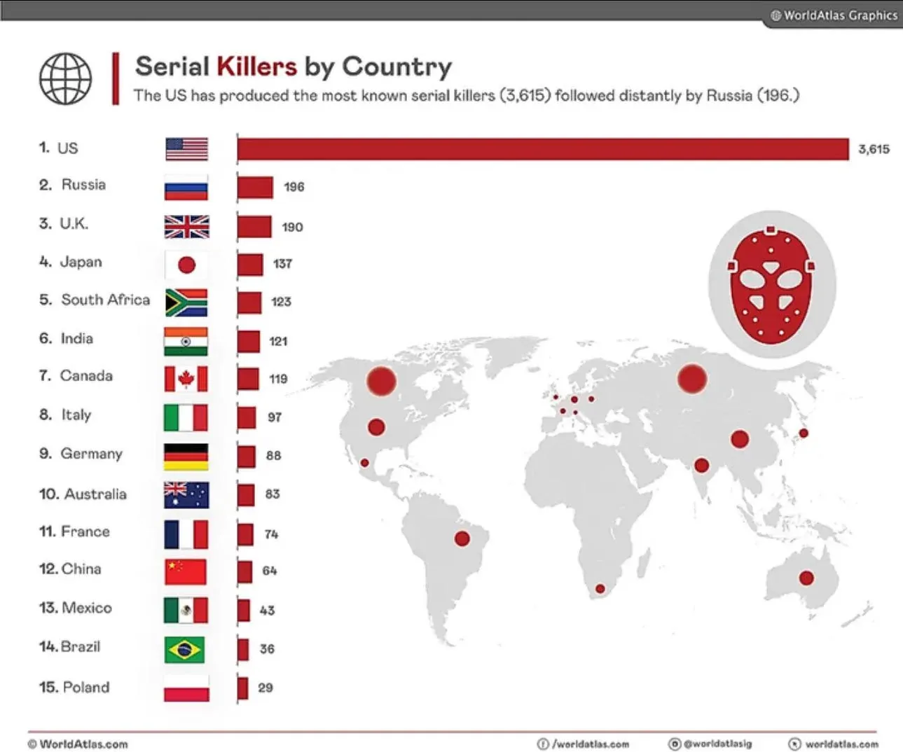

                                    Mauvaises visualisations de données

Lien du site source : https://www.luzmo.com/fr/blog/mauvaises-visualisations-de-donnees

Campagne politique au Etats-Unis :

Ce diagramme en barre est biaisé au niveau de la représentation et essaye de faire passé un message ou bien d'influencer. 
On peut s'apercevoir de ça à travers les 2 scores qui sont proche 1% d'écart cependant celle de droite (67%) est nettement plus grande.
Il faut donc toujours faire attention à l'échelle qui est prise.

Comparaison des cabinets de stratégie digitale :

Ce nuage de points qui à été créer en ayant comme but premier la comparaison de cabinets de stratégie digitale mais étant donnée que la grande majorité ce retrouve au même endroit. 
Donc il ne prouve pas une causalité et il ne classe pas.
Il faut donc faire attention aux axes de comparaison que l'on choisi afin de pouvoir produire des data visualisations pertinentes.

Classement des pays possédant le plus de tueurs en série : 

Ce diagramme en barre ne prend pas en compte certains éléments important pour la compréhension des données.
Premièrement, les barres montrent un effectif brut et pas un taux par habitant. 
Donc comparer un pays de plus de 300 millions d'habitants (les États-Unis) à un pays de 67 millions (le Royaume-Uni) c'est pas faisable et c'est faux au niveau statistique.
Enfin, il y a 2 graphiques mais ils n'ont pas de lien. On ne sait pas ce que représente les points dans la cartographie.
Il y aurait été préférable de mettre des info-bulles, légendes ou un panneau.

wajdi.ben-saad@u-pariscite.fr

